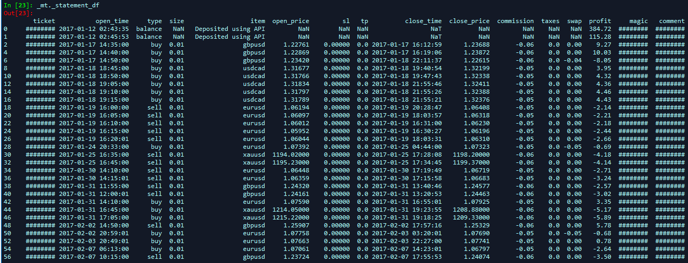

# Convert MetaTrader Reports to Pandas Dataframes

## Latest version: v2_RC4

### @author: Darwinex Labs ([click here to visit Darwinex](http://www.darwinex.com?utm_source=github&utm_campaign=darwinex-labs&utm_medium=python-script&utm_content=mt_reports_to_pandas))

## Purpose
    
This script enables traders knowledgable in Python to import 
their Account History and Strategy Tester reports directly into 
pandas dataframes.

Leverage the capabilities of Python to conduct more meaningful,
sophisitcated analyses of your track records and backtests.

## Dependencies:

    - Python 3.6+
    - BeautifulSoup 4 (bs4)
    - pandas (Python Data Analysis Library)
    - numpy (Scientific Computing with Python)

## Notes:
    
The script isolates certain structural nuances of MetaTrader's HTML report,
specified in the __init__() function.

These are at the mercy of MetaTrader, and should these change in future, the
corresponding variables in the script will require adjustments accordingly.
    
## Tested with:
    
    MetaTrader 4 Build 1170 (20 Dec 2018)
    
## Usage:
    
    >> _mt = DWX_MT_TO_PYTHON(_verbose=False,
                              _type='normal',
                              _filename='<INSERT_PATH_TO_FILE_HERE>')
                              
    1) Set _type = 'normal' for Account Histories saves as "Normal" Reports
    2) Set _type = 'detailed' for Account Histories saves as "Detailed" Reports
    3) Set _type = 'backtest' for Strategy Tester reports
    
    By default, dataframes generated are stored inside a class variable
    called '_statement_df'. Set _verbose to True to print this upon generation.
    
    >> print(_mt._statement_df)

    
## Found this code useful?

[Click here to visit us!](http://www.darwinex.com?utm_source=github&utm_campaign=darwinex-labs&utm_medium=python-script&utm_content=mt_reports_to_pandas) We're always keen to hear your feedback, suggestions and anything in between.

**Have an idea for a useful script?**

Send us an email at info@darwinex.com with the subject line **[GitHub User Request for Darwinex Labs]** and a brief description of what you have in mind.
